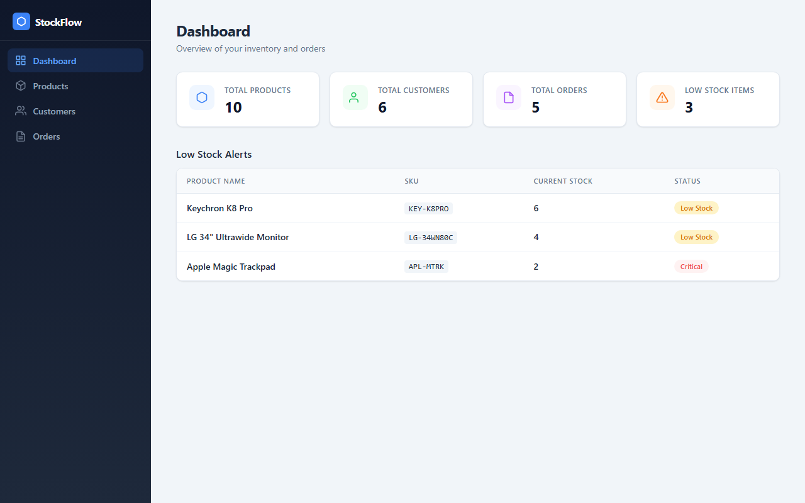
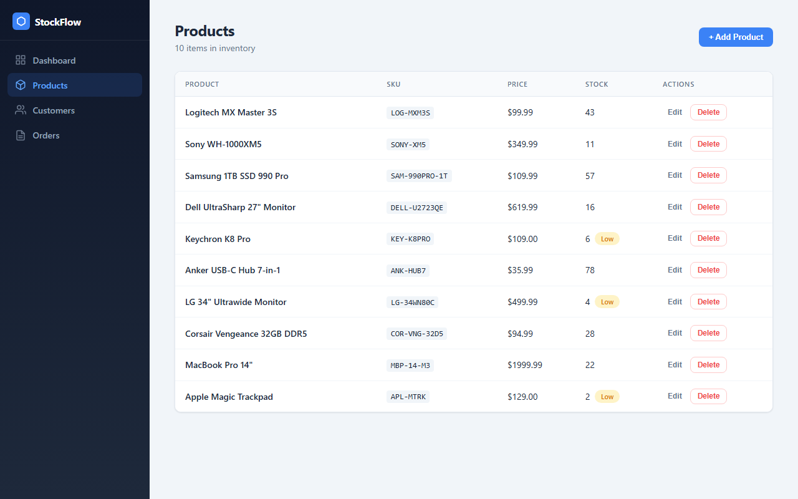
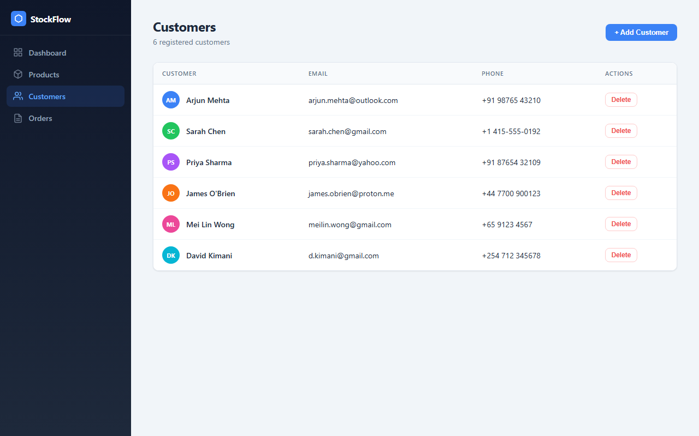
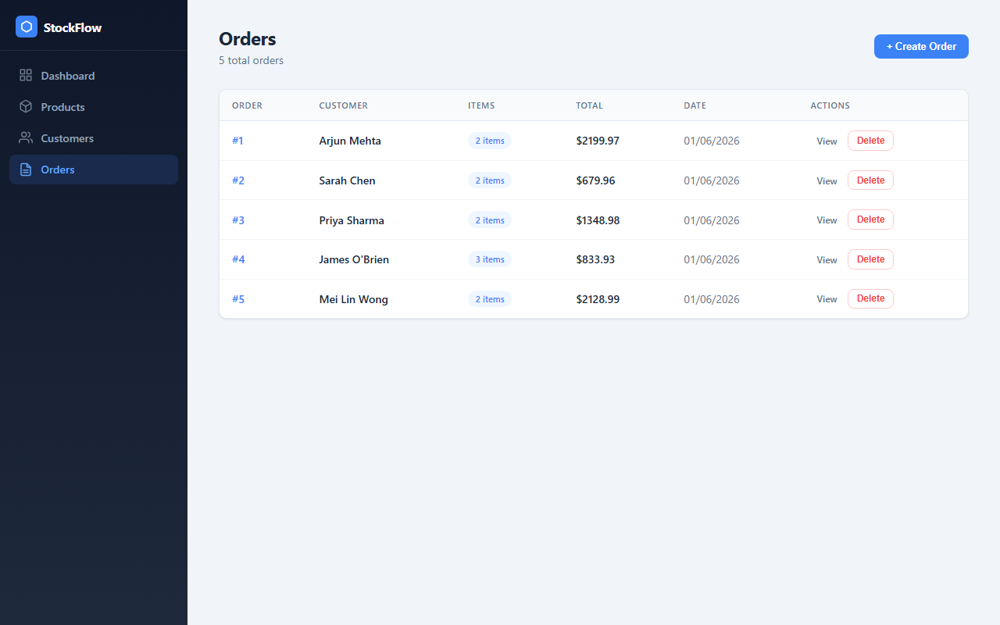
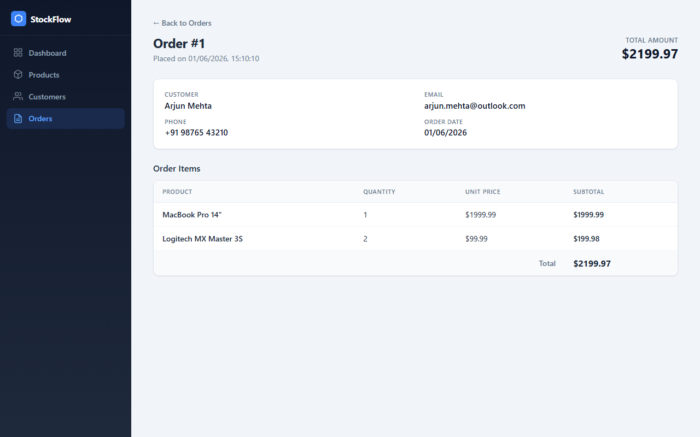

# StockFlow — Inventory & Order Management System

A full-stack inventory and order management system built with React, FastAPI, and PostgreSQL. Fully containerized with Docker and deployed on free hosting platforms.

## Live Demo

| Service | URL |
|---------|-----|
| Frontend | [inventory-management-one-kappa.vercel.app](https://inventory-management-one-kappa.vercel.app) |
| Backend API | [inventory-management-faga.onrender.com](https://inventory-management-faga.onrender.com) |
| API Docs | [inventory-management-faga.onrender.com/docs](https://inventory-management-faga.onrender.com/docs) |
| Docker Hub | [hub.docker.com/r/tejsvibhat/inventory-backend](https://hub.docker.com/r/tejsvibhat/inventory-backend) |

> **Note:** The Render free tier spins down after inactivity. The first request may take ~30 seconds to wake up.

## Screenshots

### Dashboard
Overview with summary cards and low stock alerts.



### Products
Full CRUD with inline stock badges and SKU codes.



### Customers
Customer list with avatar initials and contact details.



### Orders
Order tracking with item counts and totals.



### Order Details
Detailed view with customer info, line items, and subtotals.



## Feature Demos

All features verified with automated Playwright tests (9/9 passed).

### Product Management

| Add Product | Edit Product | Delete Product |
|:-----------:|:------------:|:--------------:|
|  |  |  |

### Customer Management

| Add Customer | Delete Customer |
|:------------:|:---------------:|
|  |  |

### Order Management

| Create Order | View Details | Delete Order |
|:------------:|:------------:|:------------:|
|  |  |  |

### Dashboard


## Tech Stack

| Layer | Technology |
|-------|-----------|
| Frontend | React 19 (Vite) |
| Backend | Python 3.11 + FastAPI |
| Database | PostgreSQL 16 |
| ORM | SQLAlchemy 2.0 |
| Validation | Pydantic v2 |
| Containerization | Docker + Docker Compose |
| CI/CD | GitHub Actions |
| Frontend Hosting | Vercel |
| Backend Hosting | Render |

## Project Structure

```
├── backend/
│   ├── app/
│   │   ├── main.py              # FastAPI app, CORS, dashboard
│   │   ├── database.py          # SQLAlchemy engine & session
│   │   ├── models.py            # Product, Customer, Order, OrderItem
│   │   ├── schemas.py           # Pydantic request/response models
│   │   └── routers/
│   │       ├── products.py      # Product CRUD
│   │       ├── customers.py     # Customer CRUD
│   │       └── orders.py        # Order CRUD + business logic
│   ├── Dockerfile
│   ├── .dockerignore
│   └── requirements.txt
├── frontend/
│   ├── src/
│   │   ├── App.jsx              # Router + sidebar navigation
│   │   ├── App.css              # Global styles
│   │   ├── pages/
│   │   │   ├── Dashboard.jsx
│   │   │   ├── Products.jsx
│   │   │   ├── Customers.jsx
│   │   │   ├── Orders.jsx
│   │   │   └── OrderDetails.jsx
│   │   └── services/
│   │       └── api.js           # Axios API client
│   ├── Dockerfile
│   ├── nginx.conf
│   ├── .dockerignore
│   └── vercel.json
├── docker-compose.yml
├── .env.example
└── .github/
    └── workflows/
        └── docker-push.yml      # Auto-push backend image to Docker Hub
```

## API Endpoints & Examples

> Base URL: `https://inventory-management-faga.onrender.com`

### Products

**Create a product**
```bash
curl -X POST /products/ -H "Content-Type: application/json" -d '{
  "name": "MacBook Pro 14\"",
  "sku": "MBP-14-M3",
  "price": 1999.99,
  "quantity_in_stock": 24
}'
```
```json
{
  "id": 1,
  "name": "MacBook Pro 14\"",
  "sku": "MBP-14-M3",
  "price": 1999.99,
  "quantity_in_stock": 24
}
```

**List all products**
```bash
curl /products/
```
```json
[
  {
    "id": 1,
    "name": "MacBook Pro 14\"",
    "sku": "MBP-14-M3",
    "price": 1999.99,
    "quantity_in_stock": 24
  }
]
```

**Get product by ID**
```bash
curl /products/1
```

**Update a product**
```bash
curl -X PUT /products/1 -H "Content-Type: application/json" -d '{
  "price": 1899.99,
  "quantity_in_stock": 30
}'
```
```json
{
  "id": 1,
  "name": "MacBook Pro 14\"",
  "sku": "MBP-14-M3",
  "price": 1899.99,
  "quantity_in_stock": 30
}
```

**Delete a product**
```bash
curl -X DELETE /products/1
# 204 No Content
```

### Customers

**Create a customer**
```bash
curl -X POST /customers/ -H "Content-Type: application/json" -d '{
  "full_name": "Arjun Mehta",
  "email": "arjun.mehta@outlook.com",
  "phone": "+91 98765 43210"
}'
```
```json
{
  "id": 1,
  "full_name": "Arjun Mehta",
  "email": "arjun.mehta@outlook.com",
  "phone": "+91 98765 43210"
}
```

**List all customers**
```bash
curl /customers/
```

**Get customer by ID**
```bash
curl /customers/1
```

**Delete a customer**
```bash
curl -X DELETE /customers/1
# 204 No Content
```

### Orders

**Create an order** (auto-calculates total, auto-deducts stock)
```bash
curl -X POST /orders/ -H "Content-Type: application/json" -d '{
  "customer_id": 1,
  "items": [
    { "product_id": 1, "quantity": 1 },
    { "product_id": 3, "quantity": 2 }
  ]
}'
```
```json
{
  "id": 1,
  "customer_id": 1,
  "total_amount": 2199.97,
  "created_at": "2026-06-01T15:10:10.000Z",
  "items": [
    { "id": 1, "product_id": 1, "quantity": 1, "unit_price": 1999.99 },
    { "id": 2, "product_id": 3, "quantity": 2, "unit_price": 99.99 }
  ]
}
```

**List all orders**
```bash
curl /orders/
```

**Get order by ID**
```bash
curl /orders/1
```

**Delete an order**
```bash
curl -X DELETE /orders/1
# 204 No Content
```

### Dashboard

**Get summary stats**
```bash
curl /dashboard
```
```json
{
  "total_products": 10,
  "total_customers": 6,
  "total_orders": 5,
  "low_stock_products": [
    { "id": 6, "name": "Keychron K8 Pro", "sku": "KEY-K8PRO", "price": 109.0, "quantity_in_stock": 6 }
  ]
}
```

### Error Responses

**Duplicate SKU (400)**
```json
{ "detail": "Product with this SKU already exists" }
```

**Insufficient stock (400)**
```json
{ "detail": "Insufficient stock for 'MacBook Pro 14\"'. Available: 2, Requested: 5" }
```

**Not found (404)**
```json
{ "detail": "Product not found" }
```

## Business Logic

- **Unique SKU** — Product SKU/code is enforced unique at the database level
- **Unique Email** — Customer email is enforced unique at the database level
- **Stock Validation** — Orders are rejected if requested quantity exceeds available stock
- **Auto Stock Deduction** — Placing an order automatically reduces product stock within a database transaction
- **Auto Total Calculation** — Order total is computed server-side as `sum(quantity * unit_price)`
- **Non-negative Stock** — Product quantity cannot be set below zero (Pydantic validation)
- **Error Handling** — All endpoints return appropriate HTTP status codes (201, 400, 404, etc.)

## Local Development

### Prerequisites
- Docker and Docker Compose

### Quick Start

```bash
# Clone the repository
git clone https://github.com/Tejsvi-Bhat/inventory-management.git
cd inventory-management

# Copy environment variables
cp .env.example .env

# Start all services
docker compose up --build
```

| Service | URL |
|---------|-----|
| Frontend | http://localhost:3000 |
| Backend API | http://localhost:8000 |
| API Docs (Swagger) | http://localhost:8000/docs |
| PostgreSQL | localhost:5432 |

### Without Docker

**Backend:**
```bash
cd backend
python -m venv venv
source venv/bin/activate  # or venv\Scripts\activate on Windows
pip install -r requirements.txt
# Set DATABASE_URL to point to your PostgreSQL instance
uvicorn app.main:app --reload
```

**Frontend:**
```bash
cd frontend
npm install
npm run dev
```

## Docker

### Images
- **Backend:** `python:3.11-slim` → production server with uvicorn
- **Frontend:** `node:20-slim` (build) → `nginx:alpine` (serve)
- **Database:** `postgres:16-alpine`

### Compose Services
The `docker-compose.yml` defines three services:
1. `db` — PostgreSQL with a named volume (`pgdata`) for persistence
2. `backend` — FastAPI app, depends on healthy database
3. `frontend` — Nginx serving the built React app

All credentials are configured via environment variables (see `.env.example`).

## Requirements Checklist

### Tech Stack
- [x] Python + FastAPI backend
- [x] React (JavaScript) frontend
- [x] PostgreSQL database
- [x] Docker containerization
- [x] Docker Compose orchestration
- [x] Git version control

### API Endpoints
- [x] POST / GET / GET {id} / PUT / DELETE — Products
- [x] POST / GET / GET {id} / DELETE — Customers
- [x] POST / GET / GET {id} / DELETE — Orders

### Business Logic
- [x] Product SKU must be unique
- [x] Customer email must be unique
- [x] Product quantity cannot be negative
- [x] Orders rejected if inventory is insufficient
- [x] Order creation auto-reduces stock
- [x] Order total auto-calculated by backend
- [x] Proper error handling with HTTP status codes
- [x] Request data validation (Pydantic)

### Frontend Features
- [x] Add / View / Update / Delete products
- [x] Add / View / Delete customers
- [x] Create / View / View details — Orders
- [x] Dashboard with totals and low stock alerts
- [x] Responsive design (desktop + mobile)
- [x] Form validation
- [x] Error and success messages

### Docker
- [x] Production-ready backend Dockerfile (slim base)
- [x] Frontend Dockerfile (multi-stage, slim base)
- [x] `.dockerignore` files
- [x] `docker-compose.yml` with 3 services
- [x] Environment variable configuration
- [x] Named volume for PostgreSQL persistence
- [x] No hardcoded credentials

### Deployment
- [x] GitHub repository
- [x] Backend deployed on Render
- [x] Frontend deployed on Vercel
- [x] Docker Hub backend image
- [x] Environment variables configured
- [x] URLs publicly accessible
